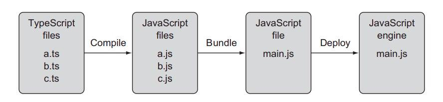
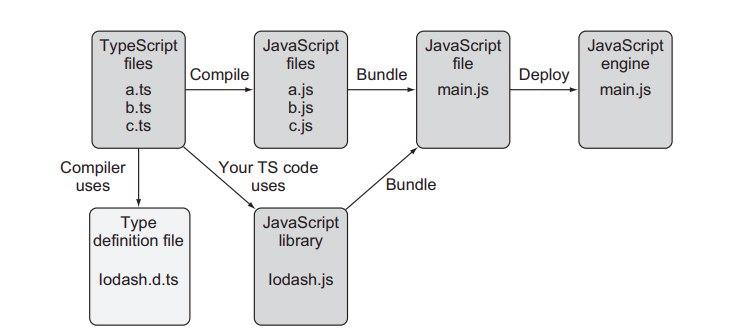

# TypeScript

### Цепочка запуска ts кода



### Цепочка запуска ts, js кода



Эта диаграмма включает файл определений типов lodash.d.ts, который используется tsc в процессе разработки. Он также включает актуальную библиотеку
lodash.js, которая будет связана с остальной частью приложения во время его
развертывания. Термин «связка» относится к процессу объединения нескольких
файлов сценариев (скриптов) в один.

### Installing typescript localy

```
npm install typescript --save-dev
```

### Installing

```
sudo apt install node-typescript
```

```
tsc 1.ts && node 1.js
```
Не компилировать если есть ошибка
```
tsc main --noEmitOnError true
```

## Webpack

JavaScript-разработчики используют различные бандлеры вроде Webpack или
Rollup, которые не только конкатенируют несколько файлов JavaScript, но также могут оптимизировать код и удалить его неиспользуемые части (выполняя
перетряхивание дерева). Если ваше приложение состоит из нескольких модулей,
каждый из них может быть развернут как отдельная связка.

## REPL

СРЕДА REPL ДЛЯ TYPESCRIPT
REPL расшифровывается как Real-Evaluate-Print-Loop (цикл чтение-вычисление-печать) и относится к простой интерактивной языковой оболочке, позволяющей
быстро выполнять фрагменты кода. Интерактивная среда TS по адресу www.typescriptlang.org/play представляет собой вариант REPL, в котором вы можете
писать, компилировать и  выполнять фрагменты кода, находясь в  браузере.
Следующий пример показывает, как можно использовать песочницу для компиляции простого TS класса в версию ES5 JavaScript.

## Целевой синтаксис
Опция компилятора --t позволяет устанавливать синтаксис целевого JavaScript файла. Например, вы можете использовать один и тот же исходный файл и генерировать его в одноранговую версию JavaScript с синтаксисом ES5, ES6 или
более новым. Так можно скомпилировать код в синтаксис ES5:

```
tsc --t ES5 main
```
## tsconfig
Tsc позволяет вам предварительно настроить процесс компиляции (устанавливая
исходную директорию и директорию назначения, целевую версию и т. д.). Если
ваш файл tsconfig.json расположен в директории проекта, вы можете просто ввести
tsc в командной строке, и компилятор считает из него все настройки.